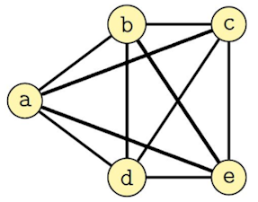
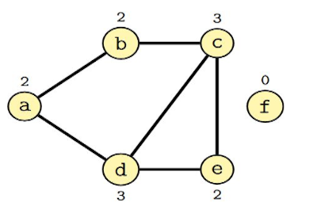
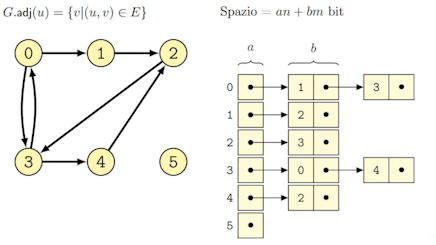
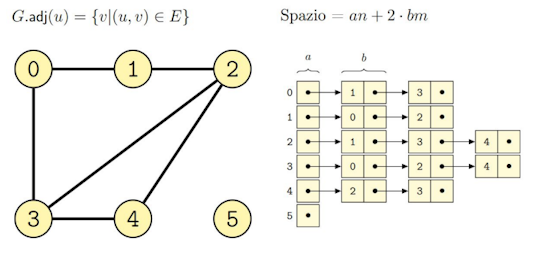

## Definizioni

### Grafo orientato

Un grafo orientato (directed) è una coppia $G = (V, E)$ dove $V$ è un insieme di nodi (node) o vertici (vertex) ed $E$ è un insieme di coppie ordinate $(u, v)$ di nodi dette archi (edge).

$V = \{a, b, c, d, e, f\}$ 
$E = \{(a, b), (a, d), (b, c), (d, a), (d, c), (d, e), (e, c)\}$

### Grafo non orientato

Un grafo non orientato (undirected) è una coppia $G = (V, E)$ dove $V$ è un insieme di nodi o vertici ed $E$ è un insieme di coppie non ordinate $(u,v)$ di nodi dette archi.

$V = \{a, b, c, d, e, f\}$ 
$E = \{(a, b), (a, d), (b, c), (c, d), (d, e), (c, e)\}$

## Terminologia

- Un vertice $v$ è detto **adiacente** a $u$ se esiste un arco $(u, v)$;
- Un arco $(u, v)$ è detto **incidente** da $u$ a $v$;
- In un grafo non orientato, la relazione di adiacenza è **simmetrica**;
- $(a, b)$ è incidente da $a$ a $b$;
- $(a, d)$ è incidente da $a$ a $d$;
- $(d, a)$ è incidente da $d$ ad $a$;
- $b$ e $d$ sono adiacenti ad $a$.

Un grafo con un arco fra tutte le coppie di nodi è detto **completo**; informalmente si dice **sparso** se ha pochi archi o **denso** se ne ha tanti.

Nei grafi non orientati il **grado** (degree) di un nodo è il numero di archi incidenti su di esso.

Nei grafi orientati distinguiamo il **grado entrante** (in-degree), ossia gli archi incidenti su un nodo, e il **grado uscente** (out-degree), ossia gli archi incidenti da un nodo.

## Dimensioni del grafo

- Numero di nodi: $n = |V|$;
- Numero di archi: $m = |E|$.

La complessità degli algoritmi sui grafi è espressa sia in termini di $n$ sia di $m$, ad esempio $O(n+m)$.

## Cammino (path)

In un grafo $G = (V, E)$, un cammino $C$ di lunghezza $k$ è una **sequenza di nodi** $u_0$, $u_1$ , …, $u_k$ tale che $(u_i, u_i+1) ∈ E$ per $0 ≤ i ≤ k−1$. Un cammino è detto **semplice** se tutti i suoi nodi sono **distinti**.

> [!Esempio] >${a, b, c, e, d}$ è un cammino semplice nel grafo di lunghezza 4.
> 

## Memorizzazione dei grafi

### Matrici di adiacenza

#### Grafi orientati

#### Grafi non orientati

### Liste di adiacenza

#### Grafi orientati

#### Grafi non orientati

## Iterazione sui grafi

#### Iterazione su tutti i nodi del grafo

Il costo computazionale è $O(n)$ per iterare sui nodi, ma il costo effettivo dipende anche dall’operazione che eseguiamo su ogni nodo (se anche quella è $O(n)$, complessivamente è $O(n^2)$).

#### Iterazione su tutti i nodi e archi del grafo

Il costo computazionale è $O(m+n)$ con le liste di adiacenza (ci sono $m$ archi e la lista di $u$ contiene solo gli archi che partono da $u$), $O(n^2)$ con le matrici di adiacenza.

#### Riassunto

| Matrici di adiacenza                                      | Liste di adiacenza                                        |
| --------------------------------------------------------- | --------------------------------------------------------- |
| Complessità $O(n^2)$                                      | Complessità $O(n+m)$                                      |
| Verificare se $u$ è adiacente a $v$ richiede tempo $O(1)$ | Verificare se $u$ è adiacente a $v$ richiede tempo $O(n)$ |
| Iterare su tutti gli archi richiede tempo $O(n^2)$        | Iterare su tutti gli archi richiede tempo $O(n+m)$        |
| Ideale per grafi densi                                    | Ideale per grafi sparsi                                   |

- Se non specificato diversamente, l’implementazione è basata su liste di adiacenza;
- L’accesso alle informazioni su un nodo avrà costo costo $O(1)$, ad esempio usando un vettore (nodi con valori `int`) o un dizionario (nodi con altri tipi);
- Le operazioni per aggiungere nodi e archi hanno costo $O(1)$, ossia il caricamento in memoria del grafo non influisce sull’algoritmo in sé;
- Dopo l’inizializzazione il grafo è statico.

## Visite dei grafi

### Visita in profondità (DFS)

È una visita **ricorsiva**: per ogni nodo adiacente alla radice, si visita tale nodo, visitando ricorsivamente i suoi nodi adiacenti; come per gli alberi, la visita può essere in pre-ordine o post-ordine. Alcune applicazioni: ordinamento topologico, componenti connesse, componenti fortemente connesse.

### Visita in ampiezza (BFS)

È una visita dei nodi per **livelli**: prima si visita la radice, poi i nodi a distanza 1 dalla radice, poi a distanza 2, ecc. Esempio di applicazione: calcolare i cammini più brevi da una singola sorgente.

Ogni volta che si attraversa un nodo, si segna che esso è già stato attraversato, per evitare ripetizioni.

## Componenti connesse

- Un grafo _non orientato_ $G=(V, E)$ è **connesso** se e solo se ogni suo nodo è raggiungibile da ogni altro suo nodo;
- Un grafo $G'=(V', E')$ è una **componente connessa** di $G$ se e solo se $G'$ è un _sottografo connesso e massimale_ di $G$;
- $G'$ è un **sottografo** di $G$ ($G'⊆ G$) se e solo se $V' ⊆ V$ e $E' ⊆ E$;
- G' è **massimale** se e solo se non esiste un altro sottografo $G''$ di $G$ tale che $G''$ è connesso e più grande di $G'$ ($G' ⊆ G'' ⊆ G$).

## Cicli

In un grafo _non orientato_ $G = (V, E)$, un ciclo $C$ di lunghezza $k > 2$ è una sequenza di nodi $u_0$, $u_1$, …, $u_k$ tale che $(u_i, u_{i+1})) ∈ E$ per $0 ≤ i ≤ k−1$ e $u_0 = u_k$.

Un grafo che non contiene cicli è detto **aciclico**. Ci serve un algoritmo che, dato un grafo non orientato $G$, restituisca `true` se $G$ contiene un ciclo, `false` altrimenti.

1. Parto da un nodo $k$, segnandolo come visitato;
2. Effettuo una DFS a partire da $k$, controllando se, scendendo in profondità, incontro nodi già marcati come visitati.
3. Se sì, esiste un ciclo (`return true`)
4. Se no? Non c’è un ciclo in questa componente, ma _potrebbe esistere_ in un’altra, quindi devo ricominciare a cercare tra i nodi non visitati.
5. Se non ho mai restituito `true` prima, alla fine restituisco `false`.
