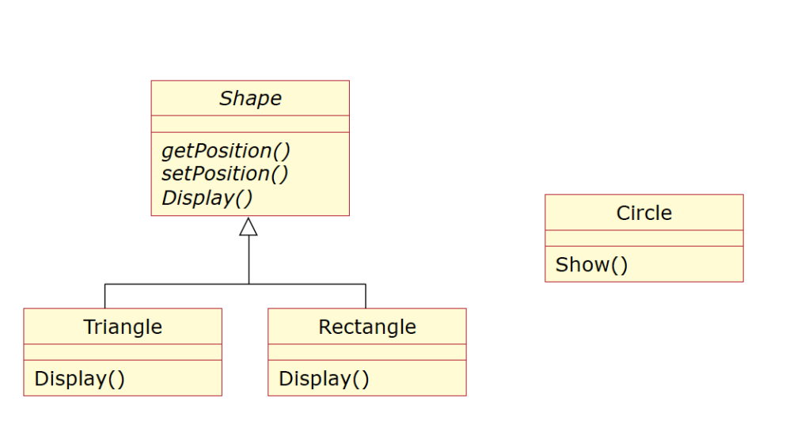

Abbiamo:

- Una classe astratta `Shape` con i metodi indicati;
- Due implementazioni specifiche (`Triangle` e `Rectangle`) che implementano il metodo `display()` per stampare la forma;
- Una classe `Circle` derivante da una libreria che ha solo il metodo `show()` per stampare la forma;
- Un client che già lavora con `Shape` di tipo triangolo e rettangolo, ci viene chiesto di aggiungere anche la possibilità di gestire cerchi, come procedete?

```ts
class Position {
  readonly x: number
  readonly y: number
  constructor(x: number, y: number) {
    this.x = x
    this.y = y
  }
}

abstract class Shape {
  protected position: Position = new Position(0, 0)
  getPosition(): Position {
    return this.position
  }

  setPosition(position: Position) {
    this.position = position
  }

  abstract display()
}

class Triangle extends Shape {
  display() {
    // logica di stampa del triangolo
  }
}

class Rectangle extends Shape {
  display() {
    // logica di stampa del rettangolo
  }
}

class Circle {
  show(x: number, y: number) {
    //logica per stampa del cerchio
  }
}

// logica del client
const shapes: Shape[] = []

shapes.push(new Triangle())
shapes.push(new Rectangle())
// fare in modo di poter aggiungere anche cerchi

shapes.forEach((shape) => shape.display())
```

Descrivere il design pattern utilizzato (nome e scopo generale) e la soluzione, includendo una breve descrizione del ragionamento e una eventuale rappresentazione del risultato finale.

## Soluzione

Per risolvere il problema si può utilizzare il design pattern **Adapter**, che permette a oggetti incompatibili tra loro di comunicare. È strutturato in questo modo:

- **Client**: la logica esistente;
- **Client Interface**: interfaccia che le classi devono usare per comunicare con il client;
- **Service**: la classe che non può essere utilizzata allo stato attuale e necessita un adattamento;
- **Adapter**: la classe che consente l'utilizzo del Service con la logica esistente. Riceve istruzioni dal client e le traduce in qualcosa che la classe incompatibile può gestire.

Si può creare un nuovo oggetto che estende `Shape` e richiama il metodo `show()` di `Circle`, in modo da poterlo utilizzare allo stesso modo del metodo `display()` di `Triangle` e `Rectangle`.

### Esempio di implementazione

```ts
class CircleAdapter extends Shape {
  private circle: Circle

  constructor(circle: Circle) {
    super()
    this.circle = circle
  }

  display() {
    circle.show(this.getPosition().x, this.getPosition().y)
  }
}
```
